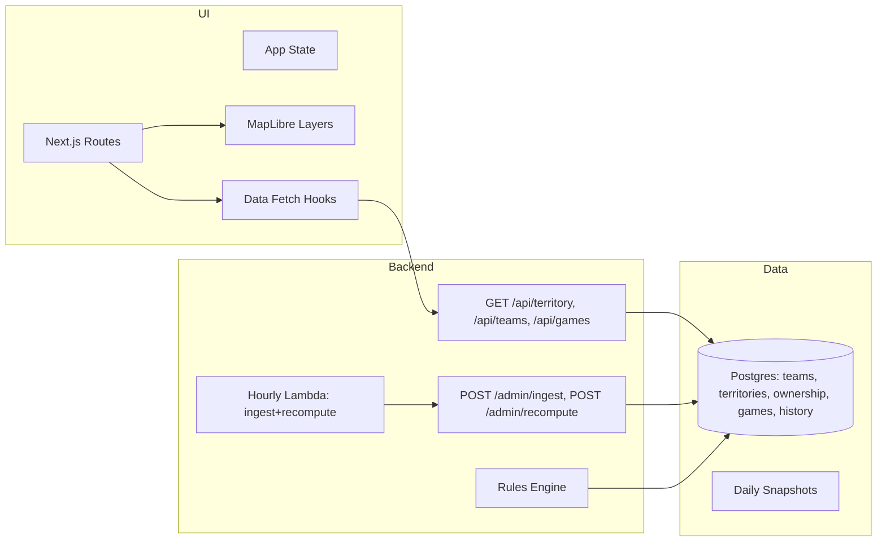

# College Football Imperial Territory Map – Technical Design Document (Revised for MVP, Cost-Minimal Hosting)

> This revision preserves the original depth and structure while incorporating two major changes:
>
> 1. **Hosting**: Vercel is **frontend-only**. Backend moves to **AWS serverless** (Lambda + API Gateway + EventBridge) to minimize monthly costs.
> 2. **Updates**: Replace frequent polling + SSE with **hourly polling via a scheduled job**. Real-time features move to post-MVP.
>
> The rest of the document keeps the same level of detail—schemas, algorithms, caching, and performance—updated to reflect the simplified MVP path.

---

## Executive Summary

A production-ready Next.js/React web application that renders a live “imperial territory” map for college football. \~130 FBS teams (expandable) compete for \~3,100 US counties; territory transfers follow a deterministic rules engine driven by completed game results. The MVP emphasizes **low hosting cost** and **minimal complexity** while remaining extensible to real-time features.

**Key Technical Decisions (MVP):**

* **Frontend**: Next.js 14 (App Router) deployed on **Vercel** (static-first + ISR)
* **Map**: **MapLibre GL JS** for WebGL vector rendering
* **Backend**: **AWS Lambda + API Gateway + EventBridge (cron)** – pay-per-use, scales to zero
* **Database**: **Supabase Postgres** (managed, low-ops; can later migrate to Aurora Serverless if needed)
* **Storage**: Vercel static for frontend, optional S3 for generated artifacts/snapshots
* **Updates**: **Hourly polling** job (EventBridge → Lambda) fetches latest results; no SSE in MVP
* **Target Cost**: **\~\$20–30/mo** initial MVP (mostly Supabase Pro; AWS usage minimal at low load)

---

## System Architecture

### High-Level Architecture

```mermaid
graph TB
  subgraph Client
    UI[Next.js/React UI]
    Map[MapLibre GL JS]
    Cache[Browser cache/SWR]
  end

  subgraph Vercel (Frontend only)
    ISR[ISR / Static Pages]
    CDN[Vercel Edge CDN]
  end

  subgraph AWS (Backend)
    APIGW[API Gateway]
    Lambdas[AWS Lambda Functions]
    EB[EventBridge (Cron)]
  end

  subgraph Data
    DB[(Supabase Postgres)]
    S3[(S3 - optional snapshots)]
  end

  UI --> CDN
  UI --> APIGW
  CDN --> APIGW
  APIGW --> Lambdas
  Lambdas --> DB
  EB --> Lambdas
  Lambdas --> S3
```

**Rationale:**

* **Vercel-only frontend** keeps DX excellent (PR previews, global CDN, ISR) without paying for dynamic backend there.
* **AWS Lambda** eliminates always-on costs for the backend. EventBridge cron provides dead-simple scheduling.
* **Supabase Postgres** remains the authoritative store (mature, generous tooling). Realtime features are not used in MVP.

### Component Architecture



---

## Technology Stack

### Core Technologies

* **Frontend**: Next.js 14 (App Router), React 18, TypeScript, MapLibre GL JS, SWR/`fetch`
* **Backend**: AWS Lambda (Node 20 runtime), API Gateway (REST), EventBridge (cron)
* **DB**: Supabase Postgres (SQL + RLS optional), pgvector (optional for future search), PostGIS-lite via GeoJSON fields
* **Infra as Code**: AWS SAM or CDK (minimal), or Terraform (one module) – **MVP can start with console + JSON** for speed
* **Testing**: Vitest/Jest (frontend), k6 or simple load scripts (backend), pgTAP (optional) for SQL

---

## Data Models and Schemas

### Core Database Schema with Versioning

```sql
-- Teams (FBS + optional FCS)
CREATE TABLE teams (
  id            VARCHAR(50) PRIMARY KEY,
  name          TEXT NOT NULL,
  short_name    TEXT,
  mascot        TEXT,
  conference    TEXT,
  color_primary TEXT,
  color_alt     TEXT,
  logo_url      TEXT,
  created_at    TIMESTAMP DEFAULT NOW()
);

-- US Counties (simplified for rendering)
CREATE TABLE territories (
  fips_code     VARCHAR(5) PRIMARY KEY,
  state_code    VARCHAR(2) NOT NULL,
  county_name   TEXT NOT NULL,
  centroid_lat  DECIMAL(10,8) NOT NULL,
  centroid_lon  DECIMAL(11,8) NOT NULL,
  area_sq_km    DECIMAL(12,4),
  population    INTEGER,
  geometry      JSONB,              -- Simplified MultiPolygon GeoJSON
  created_at    TIMESTAMP DEFAULT NOW()
);

-- Current territory owner (fast lookups)
CREATE TABLE territory_ownership (
  fips_code        VARCHAR(5) PRIMARY KEY REFERENCES territories(fips_code),
  owner_team_id    VARCHAR(50) REFERENCES teams(id),
  original_owner_id VARCHAR(50) REFERENCES teams(id),
  last_change_at   TIMESTAMP,
  last_game_id     TEXT,
  version          INTEGER DEFAULT 1,
  updated_at       TIMESTAMP DEFAULT NOW()
);

-- Game facts (ingested from provider)
CREATE TABLE games (
  id             TEXT PRIMARY KEY,
  season         INT,
  week           INT,
  kickoff_time   TIMESTAMP,
  home_team_id   VARCHAR(50) REFERENCES teams(id),
  away_team_id   VARCHAR(50) REFERENCES teams(id),
  home_score     INT,
  away_score     INT,
  status         TEXT,            -- scheduled, in_progress, final
  neutral_site   BOOL DEFAULT FALSE,
  conference_game BOOL DEFAULT FALSE,
  created_at     TIMESTAMP DEFAULT NOW(),
  updated_at     TIMESTAMP DEFAULT NOW()
);

-- Transfer history (append-only)
CREATE TABLE territory_history (
  id            BIGSERIAL PRIMARY KEY,
  fips_code     VARCHAR(5) REFERENCES territories(fips_code),
  prev_owner_id VARCHAR(50) REFERENCES teams(id),
  new_owner_id  VARCHAR(50) REFERENCES teams(id),
  game_id       TEXT REFERENCES games(id),
  reason        TEXT,           -- rule id/msg
  changed_at    TIMESTAMP DEFAULT NOW()
);

-- Job bookkeeping to guarantee idempotency/locking
CREATE TABLE job_runs (
  job_name      TEXT,
  run_started   TIMESTAMP DEFAULT NOW(),
  run_finished  TIMESTAMP,
  success       BOOL,
  details       JSONB,
  PRIMARY KEY (job_name, run_started)
);
```

### TypeScript Interfaces

```ts
export type Team = {
  id: string; name: string; shortName?: string; mascot?: string;
  conference?: string; colorPrimary?: string; colorAlt?: string; logoUrl?: string;
};

export type County = {
  fips: string; state: string; name: string;
  centroid: { lat: number; lon: number };
  areaSqKm?: number; population?: number; geometry: GeoJSON.MultiPolygon;
};

export type Game = {
  id: string; season: number; week: number; kickoffTime: string; status: 'scheduled'|'in_progress'|'final';
  homeTeamId: string; awayTeamId: string; homeScore?: number; awayScore?: number;
  neutralSite?: boolean; conferenceGame?: boolean;
};

export type Ownership = {
  fips: string; ownerTeamId: string; originalOwnerId?: string; lastGameId?: string;
  lastChangeAt?: string; version: number;
};

export type TransferEvent = {
  fips: string; fromTeamId: string; toTeamId: string; gameId: string; at: string; reason: string;
};
```

---

## Territory Rules Engine

### Core Imperial Map Rules (unchanged)

1. **Initialization**: Each county starts owned by the nearest FBS team (by county centroid → home stadium geodesic distance), with manual overrides for edge cases.
2. **Head-to-Head Transfer**: When Team A defeats Team B (final), Team A gains **all** counties owned by Team B **contiguous** to any county already owned by Team A (contiguity over county boundaries), or use a simpler **all-of-loser** rule for MVP if contiguity is too complex.
3. **Neutral/Non-D1 Games**: Only FBS vs FBS games count in MVP (flag others as `ignored_reason`).
4. **Ties/No-Contest**: No transfers.
5. **Conference/Division Exceptions** (post-MVP): Adjust weights or special handling if desired.

> **MVP Choice**: Use **all-of-loser** transfer for deterministic simplicity. Contiguity-based transfers can be enabled later with graph traversal.

### Territory Transfer Algorithm

```pseudo
function applyTransfers(finalizedGames):
  // Idempotent: compute a deterministic key for each (gameId)
  for game in finalizedGames:
    if already_applied(game.id): continue

    winner, loser = resolveWinnerLoser(game)
    if !winner or !loser: continue

    // MVP rule: winner takes all counties owned by loser
    UPDATE territory_ownership
      SET owner_team_id = winner.id,
          last_change_at = now(),
          last_game_id = game.id,
          version = version + 1
      WHERE owner_team_id = loser.id;

    INSERT INTO territory_history (...);
```

**Contiguity (post-MVP)**: Precompute county adjacency graph (edge list of neighboring FIPS). Replace UPDATE with a filtered set computed by BFS from winner frontier into loser’s connected components.

---

## API Integration Strategy

### CFBD API Integration

* Data provider: CollegeFootballData API (or similar) using API key.
* Endpoints (MVP):

  * `GET /games?year=YYYY&week=W&division=fbs` – fetch game list + status
  * `GET /games/boxscore?id=...` (optional) – detailed stats if needed
* Ingestion Lambda stores/updates rows in `games` table. Finalized games trigger transfer computation.
* **Backoff & idempotency**: maintain `last_seen_status` and `etag/hash` per game to avoid redundant writes.

### Game Monitoring Implementation (Revised)

* **Before**: 5-min polling during games + SSE to clients
* **Now (MVP)**: **Hourly EventBridge schedule** invokes a single **ingest-and-apply** Lambda:

  1. Acquire DB job lock (e.g., `pg_advisory_lock` or `job_runs` row with `FOR UPDATE SKIP LOCKED`).
  2. Fetch games updated within the last 48 hours.
  3. Upsert into `games` table.
  4. Filter `status = 'final'` where transfer not yet applied.
  5. Run **applyTransfers**.
  6. Write summary metrics to `job_runs`.
* **Manual re-run**: Admin endpoint `POST /admin/recompute?from=YYYY-MM-DD` for one-off corrections.

---

## Map Rendering Solution

### MapLibre GL Implementation

* **Base Layers**: Vector tiles for US counties (simplified geometries). We can ship a single GeoJSON (\~5–10MB after simplification + gzip + brotli) for MVP, or pre-tiled vector source later.
* **Data Join**: Join `territory_ownership` to county layer via `fips_code` with a client-side map of `fips -> ownerTeamId` fetched from `/api/territory`.
* **Styling**: Fill color by team primary color; thin strokes for boundaries; hover tooltip shows county & team.
* **Performance**: Use `feature-state` for hover highlighting; throttle pointer events; prefer `circle` layers for centroids in low-zoom.

---

## Client Data Access

* **Endpoints** (API Gateway → Lambda):

  * `GET /api/territory`: returns `{ fips: string, ownerTeamId: string, version: number }[]` with an overall `datasetVersion` for cheap cache-busting.
  * `GET /api/teams`: returns lightweight team metadata necessary for legend and colors.
  * `GET /api/games?season=&week=`: returns stored `games` rows (no provider fan-out from client).
* **Caching/Headers**:

  * `Cache-Control: public, s-maxage=300, stale-while-revalidate=3600` for territory.
  * Add ETag with `datasetVersion`.
* **Frontend Fetching**: SWR with eTag-aware fetcher; **no SSE in MVP**.

---

## Real-Time & Streaming (Post-MVP)

* **SSE/WebSocket**: Reserve a channel `GET /api/stream` later; the server publishes transfer events as they occur.
* **Adaptive Polling**: Optional game-day switch to 5-min polling only during high-interest windows.
* **Edge Functions**: Consider Cloudflare Workers or Vercel Edge for ultra-low-latency fan-out later.

> **MVP Decision**: Omit to reduce complexity and compute overhead. Hourly cron is sufficient.

---

## Historical Tracking System

### Time-Travel Implementation

* **Snapshots**: Nightly snapshot Lambda writes `territory_ownership` → `S3://snapshots/YYYY-MM-DD.json` (or Postgres table `territory_snapshot(date, fips, owner)`).
* **Delta Reconstruction**: UI can replay `territory_history` events to animate changes for a given season.
* **Indexing**: Composite index on `territory_history(fips_code, changed_at DESC)` and `(... new_owner_id)` for fast queries.

---

## Caching Strategy

### Multi-Layer Cache Architecture

1. **Database**: `territory_ownership` is the hot read path; computed hourly.
2. **API Cache**: API Gateway + CDN honor cache headers (5 minutes fresh, 1 hour SWR) for territory payload.
3. **Frontend**: ISR for landing pages; client SWR keeps UI responsive.
4. **Artifacts**: Optional daily snapshot JSONs served via S3/CloudFront (or Vercel static if small).

**Idempotency & Concurrency**

* Use `SERIALIZABLE` transaction or row-level lock on `job_runs` to ensure only one compute job runs at a time.
* `applyTransfers` is idempotent keyed by `game_id`.

---

## Performance Optimizations

### Frontend Optimizations

* Use **static imports** for small team metadata; lazy-load heavy map data.
* Turn on `brotli` in Vercel, serve gzipped GeoJSON with `Content-Encoding`.
* Use `MapLibre` `promoteId` for feature joins.

### Backend/DB Optimizations

* Indexes:

  * `CREATE INDEX ON territory_ownership(owner_team_id);`
  * `CREATE INDEX ON territory_history(fips_code, changed_at DESC);`
  * `CREATE INDEX ON games(status, updated_at);`
* Batch writes for `applyTransfers` (single UPDATE per loser).
* Avoid N+1: return lean payload for `/api/territory`.

---

## Development Phases (MVP-first)

### Phase 1: Foundation (Week 1)

* Repo setup, Next.js skeleton, basic map rendering with mock data.
* Supabase schema migration.
* Deploy frontend to Vercel, stub backend endpoints.

### Phase 2: Ingestion (Week 2)

* Lambda ingest for games; write to `games` table.
* Admin recompute endpoint.

### Phase 3: Rules Engine (Week 3)

* Implement MVP **all-of-loser** rule + history log.
* `/api/territory` & `/api/teams` finalized.

### Phase 4: Hourly Scheduling (Week 4)

* EventBridge cron → ingest + applyTransfers.
* Add job locks + metrics.

### Phase 5: UX, Snapshots (Week 5)

* Legend, team filters, county hover tooltips.
* Nightly snapshot job (optional).

### Phase 6: Polish & Launch (Week 6)

* Perf pass, error monitoring, analytics.
* MVP release.

> **Real-time** features, contiguity rules, and advanced visualizations are explicitly **post-MVP**.

---

## Cost Analysis (Updated for MVP)

### Monthly Operating Costs (rough order-of-magnitude)

* **Vercel (Hobby/Pro)**: \$0–\$20 depending on bandwidth/builds.
* **AWS Lambda + API Gateway + EventBridge**: \$1–\$5 at low traffic (cron + light reads); increases with API traffic.
* **Supabase Postgres**: Free tier may suffice initially; **Pro \$25** recommended for reliability.
* **S3 (snapshots)**: <\$1 unless heavy.

**Total MVP Target**: **\~\$20–30/mo**.

### Scaling Considerations

* If API traffic spikes, add CloudFront in front of API Gateway or increase cache TTLs.
* If DB write contention grows, move compute to an Aurora Serverless v2 cluster with stored procedures.
* If GeoJSON size becomes a bottleneck, move to pre-tiled vector tiles (Tippecanoe + Tileserver).

---

## Hosting Options – Evaluation (Backend)

| Option                           | Runtime Model           | Pros                                             | Cons                                                     | Est. Cost (MVP) |
| -------------------------------- | ----------------------- | ------------------------------------------------ | -------------------------------------------------------- | --------------- |
| **AWS Lambda + API GW** (chosen) | Serverless, scales to 0 | Lowest ops, cron via EventBridge, rich ecosystem | Cold starts (minor), IAM learning curve                  | **\$1–\$5**     |
| Supabase Edge Functions          | JS/TS on Deno, near DB  | Simple, co-located with DB, built-in auth        | Vendor lock-in, fewer schedulers (cron via pg/scheduler) | \$0–\$5         |
| Vercel Serverless/Edge           | Node/Edge, great DX     | Unified stack                                    | Paid tiers for sustained backend, limited cron           | \$0–\$10        |
| Cloud Run/Functions              | Container/serverless    | Docker flexibility                               | Slightly more setup                                      | \$1–\$5         |

**Decision**: Start on **AWS Lambda** for backend. Retain **Supabase** for DB to avoid migration work. Revisit consolidation (Aurora or all-in Supabase) later based on usage.

---

## Implementation Notes

### Environment Variables (Backend)

**Required**

* `CFBD_API_KEY` – external data provider key
* `DATABASE_URL` – Supabase Postgres connection string
* `RATE_LIMIT_RPS` – (optional) cap on provider requests

**Optional**

* `SNAPSHOT_BUCKET` – S3 bucket for daily snapshots
* `ADMIN_TOKEN` – shared secret for admin endpoints

### Key Dependencies

* Frontend: `next`, `react`, `maplibre-gl`, `swr`
* Backend: `pg` (node-postgres), `undici`/`node-fetch`, `zod` (validation)
* Tooling: `tsx` for Lambda bundling, or esbuild

### Example Lambda Pseudo-code (Ingest + Apply)

```ts
export const handler = async () => {
  const lock = await tryAcquireJobLock('hourly-ingest');
  if (!lock) return { statusCode: 200, body: 'Another run active' };
  try {
    const changedGames = await fetchProviderGames({ sinceHours: 48 });
    await upsertGames(changedGames);
    const finals = changedGames.filter(g => g.status === 'final');
    await applyTransfers(finals);
    await recordRun({ success: true, count: finals.length });
    return { statusCode: 200, body: 'ok' };
  } catch (e) {
    await recordRun({ success: false, error: String(e) });
    throw e;
  } finally {
    await releaseJobLock('hourly-ingest');
  }
};
```

### Testing Checklist

* [ ] Unit tests for `resolveWinnerLoser` and transfer algorithm
* [ ] Idempotency test: applying same finals twice yields no net change
* [ ] Schema migration test (db init on empty DB)
* [ ] API e2e: `/api/territory` returns stable shape and version
* [ ] Map load test with 3k+ features and fast pan/zoom
* [ ] Backfill: seed initial ownership and verify deterministic results

---

## Risks & Mitigations

* **Provider Inconsistencies**: Use `updatedSince` polling window + reconciliation job.
* **Long-running Cron**: Keep ingestion batched; paginate API calls; guard with timeout; split into two Lambdas if needed.
* **Cold Starts**: Keep bundle lean; use Node 20; provisioned concurrency is optional if needed later.
* **Geometry Size**: Simplify polygons; convert to tiles when needed.

---

## Conclusion

This revision keeps the original technical rigor—clear schemas, deterministic rules, caching, and performance guidance—while simplifying operations and cost: **Vercel for frontend only**, **AWS serverless** for backend, and **hourly polling** for updates. Real-time features and contiguity-based transfers remain cleanly factored as **post-MVP** enhancements without architectural rework.
